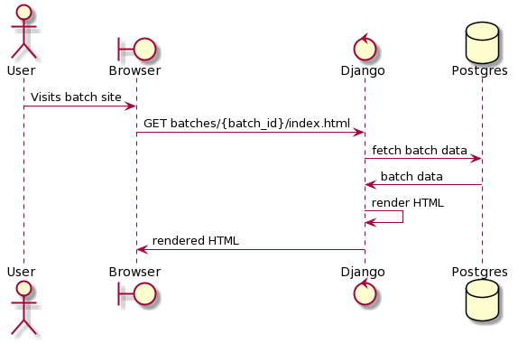
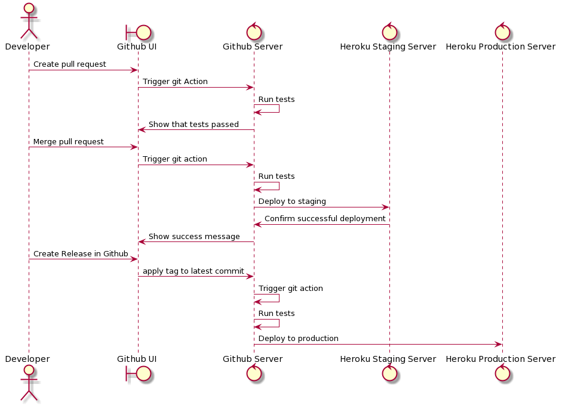
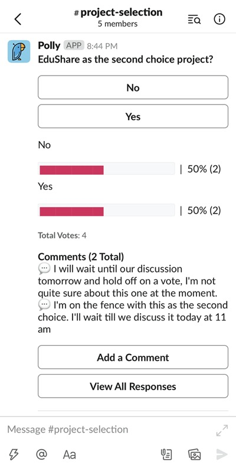
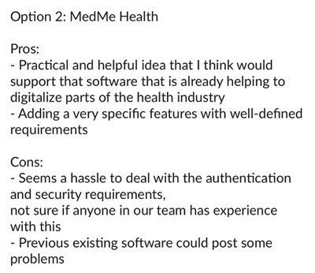

# UPENDO HONEY / TEAM 3
> _Note:_ This document is meant to evolve throughout the planning phase of your project.   That is, it makes sense for you commit regularly to this file while working on the project (especially edits/additions/deletions to the _Highlights_ section). Most importantly, it is a reflection of all the planning you work you've done in the first iteration. 
 > **This document will serve as a master plan between your team, your partner and your TA.**

## Product Details
 
#### Q1: What are you planning to build?

We’re working with a social enterprise from Tanzania that helps beekeepers sell their organic honey to high end consumers primarily in Europe, but also in Australia, and North America. 

They have two types of consumers:
1. Honey wholesalers who rebrand the honey for their local markets
2. Other food and beverage businesses who want to add the honey to their products  (e.g. microbreweries who want to add organic honey to their beer)

Their goal is for this product to accomplish the following:
* Increase the popularity of Tanzanian honey on the global market
* Increase the perception of Tanzanian honey as a high value commodity (and distinguish it from cheaper, more common non-organic honey originating in Europe or China)
* Create a conversational ‘talking point’ for customers of Upendo Honey’s  business partners (e.g. retailers, brewhouses) by allowing them to scan the jar or pull up a URL which explains the “cool factor” of this product

To solve this problem, we are building a web application that will allow:
1. Consumers to look up where their honey comes from, its health benefits, and whom they’re supporting
2. Consumers to share the content from #1 over social media
3. Upendo admins to monitor usage across their site to assess how successful it is

Use cases (i.e. how our product will be used)
* A consumer buys a jar of retail honey that was harvested by Upendo, they are curious about where it comes from, and they scan a QR code on the back of the honey
* A consumer who has bought a product that has Upendo-harvested honey in it wants to tell their friends about how cool it is, so they share a link to details about that batch with their friends on social media
* A retail who receives Upendo’s a marketing deck, and wants to know if Upendo’s values align with those of their brand

For early stage designs built on InVision please see our [mock-up](https://invis.io/SRXIQCLXJHQ)

#### Q2: Who are your target users?

Target users of the application are:
* Curious purchasers of tanzanian honey from Upendo Honey who bring their product home who may stumble upon a code for the web application
* Environmentally friendly consumers who are concerned with the production of organic honey produced naturally with minimal human intervention.
* Logistically curious consumers who would like to understand where and how their retail honey is produced and manufactured into a product.
* Socially conscious consumers who would like to understand the people or labour force involved with the harvesting of honey, particularly organic honey.
* Honey Companies and Organizations that want to advertise where their product is stored and inform their customers with interesting stories to entice them into buying their product
* Honey manufacturers who would like to build awareness of organic honey production to support workforce wages and communities built on the market.

An example persona for a customer of Upendo [here](https://app.flowmapp.com/share/e3117da4390acbb8c1ea0f13cc42a0d0/personas/14239/)

#### Q3: Why would your users choose your product? What are they using today to solve their problem/need?
    
We need the product because it provides a specific and targeted solution to the partner’s problem of increasing the value and awareness around Tanzanian honey by appealing to ethically-concerned and curious consumers.  These consumers don’t just care about price and quality, they also want to know where their food comes from and whom they’re supporting.  By relating their purchase of honey to this information through the use of an interactive web-app with portions that can be shared on social media, we are appealing to our target demographic in a way that gets them to learn more about Tanzanian honey and spread the word by virtue of their own interest.  This particular connection, between the honey and the location, presented in a visually-interactive manner  is what aligns with the partners goals for this project of improving the perception of Tanzanian honey, creating a conversational talking point and as a result, increasing its popularity on the market.

So what makes our product different and what needs does it fulfill? At a farmers market, you can see folks from the farm and ask them questions. When you’re buying something from far away, it’s difficult to do that. Our product will help foster a strong connection between customers of this company and the beekeepers by telling a story about the forest and people that the honey came from.   Other apps, such as this one: [Origin Trail](https://www.foodbev.com/news/interview-origintrail-the-app-that-tells-you-where-your-food-is-from/?__cf_chl_jschl_tk__=58a2638f521c6d9a6e0be63e1828f69b45f20bbb-1590363303-0-AV2gnUz3o1Eg9QBwM9Z1JDD3boGQV9H6Zo-XF3W7MnMxX3x_eRkxJ2rwZHkd8xedPgdiqRdpCEIQpYnCnkRxYQKR0EwLrL618kg49gLZyJaeLGFAAz8oIB-tl8jGlKJAv-oYlnkwjOlkYqFA92koDE_LR14vHVjRuquysSqd4908YiV4rhg1I7us8nsFE99TtfcWXvggfghZzJsAvu1xE4DRb5qQMIgOzY2dzFVOiVg1aNL8bWXTvPBJImRULWMdirkwe-TmCB7w3OMppOUO0GtBWBGcHh1RtU00Wq5UA1iGlZitaJs-FxVKFOpfl_KMjk-pHgFcZBdLWWP_8KeniwAWdUHibUibY9x7sQDIoGIIcFClsREhWIDyZjtDKrAd6A) have the traceability feature we provide, however they do not build the sense of community that our product aims to provide through personalized stories. 

Lastly, it will give socially-conscious consumers and companies a sense of trust in the product, by providing information on where the honey comes from, who benefits from it and the environmental impact.  This allows honey retailers who source from Upendo in particular to market their brand using reliable information.  This app will allow both consumers and companies to find information about Tanzanian honey produced by Upendo in a more convenient, and enjoyable manner - it is a better experience for someone to visualize where the honey comes from interactively, rather than read a big paragraph about it on a website.

#### Q4: How will you build it?

The partner desires a website to promote Tanzanian Honey, however their main website is intended to be geared specifically towards mobile users. In addition the website needs to have easier maintenance due to the absence of a designated tech team that will take over the project. With these in mind we will be using the following:

React.JS will be used for front-end purposes, supplemented by the ionic framework key features to work specifically on mobile development. The application will be developed in the standard HTML, CSS and JavaScript languages, communicating with the backend with standard HTTP(S) protocols. By using common industry tools, the project will be maintainable and also improvable by developers, while maintaining support of most modern browsers.

Django will be used for the main backend framework and it will work in conjunction with PostgreSQL to maintain a database for the website. This was chosen due to the desire for simplicity of use and interface. Django allows backend maintenance workers to work with a simpler interface. PostgreSQL is the most common database language and one which our partner has experience using.

Our deployment and testing will involve using a mixture of Jest (for testing web features), the Ionic framework’s built-in CI/CD pipeline features, Github Actions (for automated testing and deployment) and Heroku (for deploying a host for our website). Our main testing strategy for our (relatively simple) website is to develop unit tests for each web component used on the mobile web app. This ensures that each screen individually works well on a mobile phone. For backend end this will involve unit testing each database transaction and manipulations to objects (particularly string manipulations). In addition, to perform integration testing, we will have mock protocols to simulate front/back ends of the website.

The following is a draft diagram of the architecture.
High level components - web application:
* Django backend server, hosted by Heroku
* Postgres cluster, hosted by Heroku

The following is a depiction of our anticipated development stages.
High level components - deployment flow:
* Github - hosts source code
* Github Actions - perform unit tests and push deployments
* Heroku Server - hosts staging and production code

The website will roughly have an input for a code received by a honey consumer that will take them to a customized image introducing tanzanian honey. There will be images for the user to scroll through to take them to a page describing various aspects of honey production in Tanzania. They later are able to discover each aspect in more detail, whichever the user is most interested in. We will use an API that allows users to easily post their interests in whichever subject on their social media accounts. This simplifies the sharing of Upendo Honey’s promotion of honey.

For more information explaining user flow and components please see this [diagram](https://app.flowmapp.com/share/e3117da4390acbb8c1ea0f13cc42a0d0/userflow/92122/)

#### Q5: What are the user stories that make up the MVP?
 
| #  |     User Story     |  Acceptance Criteria |
|----------|:-------------:|:------:|
| | |
| 1 |  As an ethically-, environmentally- and health-conscious consumer, I want to read about Upendo Honey product and its origins (i.e. beekeepers that produce honey and their work conditions, forests where the honey is produced, honey qualities) in order to decide if Upendo Honey product meets my standards in regards to fair trade for me to buy it / continue buying it. | Information about each honey jar with a QR code / alphanumeric code, beekeepers that produced this honey and the forest of the honey origins should be clearly divided into different app subsections and be one-click accessible within the Upendo Honey application.  |
| | |
| 2 |  As a person who wants to read about Upendo Honey products without spending too much time on it, I want to be able to access information about a particular honey jar and its origins as quickly and as easily as possible to both get the information and save my time and effort.   |   A user should be able to scan QR code with any QR code scanner and/or enter a alphanumeric code at Upendo Honey application to open an application view with all the information about a particular honey jar and its origins    |
| | |
| 3 | As a curious consumer I want to see some new information about the product I consume in order to be entertained. |    UI should be simple and content-oriented to make it easier for a user to see images and read text. |
| | |
| 4 | As a person who likes beekeeper stories / forest images / health information / map information I want to share them on my social media in order to discuss them with my social media friends.|    Facebook, Twitter and Instagram sharing should be available for each beekeeper story / forest information / health information / map. |
| | |
| 5 | As Upendo Honey content manager I want to be able to add new content and edit content easily via an admin system in order to simplify the process of managing the content. |    User-friendly admin system should be available. |
| | |

----

## Process Details

#### Q6: What are the roles & responsibilities on the team?

Describe the different roles on the team and the responsibilities associated with each role. 
 * Roles should reflect the structure of your team and be appropriate for your project. Not necessarily one role to one team member.

List each team member and:
 * A description of their role(s) and responsibilities including the components they'll work on and non-software related work
 * 3 technical strengths and weaknesses each (e.g. languages, frameworks, libraries, development methodologies, etc.)
 
 1. Ashwin is a mature student who has worked for many years in the web development industry. He has experience working with business stakeholders to create technical roadmaps, and his technical expertise is in backend systems. He will be serving as the Product Manager to help the partners identify a vision and scope for the product, and he will be working with Natalia on the backend architecture and CI/CD for the project.

Skills: JavaScript, Python, Distributed Systems
Weaknesses: Aesthetics, product design, CSS

2. Conroy is a third year student at UTSC. He is well-versed in systems programming, Linux/Unix and bash scripting, and enjoys leadership roles. He will be serving as the scrum master for the project where he will be responsible for handling sprints, faciliating meetings and managing backlog tasks.  He will be working on the frontend alongside Linda.

Skills: Java, C, Linux/Unix systems programming
Weaknesses: Backend frameworks, infrastructure, web communication protocols

3. Linda is also a third year student at UTSC. She enjoys functional programming and product design. She will be responsible for documentation and note taking for the team which means recording meetings on Google Docs and tracking decisions made by the team. She will be responsible for the frontend alongside Conroy.

Skills: Python, UI design, functional programming
Weaknesses: Backend, testing frameworks, web frameworks

4. Natalia is also a mature student, with many years of experience in both the creative design industry and as a business systems analyst. She will be the project manager where she will responsible for managing deadlines, keeping the development on track and will be coordinating the backend and CI/CD alongside Ashwin.

Skills: project planning, requirements analysis, frontend design
Weaknesses: backend, CI/CD, git

#### Q7: What operational events will you have as a team?

The development team will be meeting twice a week  to discuss ideas, development progress and details over a zoom call. Each scheduled call will change per week depending on the appropriate progress of the project and the needs of our partner Upendo Honey. No in-person meetings will occur throughout the COVID-19 crisis. Each development meeting’s purpose will be to discuss the progression of research and development of application features.  This will occur in the fashion of scrum standups where we each identify what was done, what will be done and any obstacles we are facing. In addition it will be to update any tools or ideas that would solve the partner’s needs in an appropriate fashion.

Meetings with the partner will occur once per week at 9:30 am to accommodate their different time zone needs. Meeting with the partners will only be concerned over the completion of the objectives for the project and appropriate deadlines.  For each meeting our team will prepare an outline of our progress and an agenda for items we want to discuss with the partner.  Please see below the progression of prepared topics in our previous meetings under the “agenda” section.  They can also present any new concerns or needs for the future of the project.

In our meetings with our partner we discussed the exact specifications of the website project, specifically the way the website is presented to mobile users. We thoroughly addressed the 4 main areas in which consumers/users will explore most: environmental sustainability and the Tanzanian Forest, infrastructure of Honey workers, the benefits of organic honey, and the origins of the honey.

Meeting outcomes involved having specific appearances and templates to produce for our application. We have regular meetings from approximate ~9:30 - 11:00, usually ending early once all agenda items are addressed.

**Meeting Minutes (With Partner):**

**Meeting 1: Understanding Partner Requirements (9:30am, Tuesday May 26th, 2020)**

Agenda:
1. Upendo Honey to introduce their product and their vision/ideas for the application, including:
   * Target audience: different types of users and their goals
   * How these users are accomplishing their goals now, and why that’s not good enough
   * Prioritized ranking of the goals
2. CSC301 team to introduce team members and their initial understanding of the product
3. Discuss technology: web-first or mobile-first?
4. Set goals for the second meeting (proposed date: Tuesday, June 2)

Discussion:
* Traceability system for all beekeepers
* Upendo will have a alphanumeric code to input into website
* The overall goal is to develop awareness for Tanzanian honey to incur a premium on their honey
* Develop their honey so they stand out to general consumers and to partner business (such as retailers)
* There is a firebase backend for hosting using a MongoDB database to store the information which needs to be transferred to a SQL database. 
* Sharing Tanzanian Honey easily using our app for social media purposes.
* Tracking the user flow and frequency of distinct portions of the website.
* The website will almost entirely be used by mobile users
* Beekeeper images are not common for social purposes (they don’t smile in photos) making it harder to have many beekeeper photos that are appealing
* They have pictures for:
   * The processing plant
   * Honey
   * Tanzanian forest
* Honey harvesting is a twice annual process, involving different beekeepers each time, which means that labour is very fluid in and out.

Outcomes:
* Developed a better understanding of Upendo and their operations as a business
* Learned about how the app is meant to meet their current needs of increasing the added-value of Tanzanian honey
* Identified areas in which the partner was not clear on their ideas and attempted to fill in the gaps by formalizing questions to have partners answer in Google document prior to the next meeting

**Meeting 2: Clarifying partner Requirements (9:30, Tuesday June 2nd, 2020)**

Agenda: 
1. Present idea of “Letters from Beekeepers” application to the partner using prepared mock-ups and user flow diagram.
2. Allow the partner to provide feedback and comments on the proposal
3. Identify a set of next steps to prepare deliverable 1 including any changes that need to be made suggested by the partner

Discussion:
* Explained the proposed idea by framing it as a shift in focus from the map tracing idea, to a focus on the beekeepers who harvested their honey
* Presented the vision for the modified application using InVisio, then outlined the User Flow diagram with the partner
* Partner expressed approval of the idea and detailed how they have been thinking for a while on how to express the various benefits of their company and which ones to focus on:
  * In particular providing income for local people, maintaining an organic pathway (with no pesticides) and preserving the local habitat for wildlife management.
* Team proposes presenting the three different pathways through a menu, but making it adjustable which of the three sections a customer is first brought to when they enter the code on their honey jar.
  * To help solve the problem of which topic is the most interesting for customers, to serve as a talking point, suggested to partner to collect analytics on time spent on each section and which sections were most visited
* Partners approve of the idea
* User stories as then presented and explained.  Partner and team agrees to allow partner to first comment of each of the three presented components: mock-up, user flow and user stories prior to team finalizing D1

Outcomes:
* Finalized the idea for D1 with partner approval by including modifications to cover topics that the partner wanted to present
* Obtained specific feedback from partner through the comments provided on drafted work
* Clarified the details of the software to the point where we could begin to decide on the technology we wanted to use.

  
#### Q8: What artifacts will you use to self-organize?

Communication and organization are key components to our team’s development process. Slack will continue to act as our main platform for group communication in-between our twice a week Zoom meetings.  Meeting minutes will be recorded briefly on Google docs for reference. We will be using our [Trello](https://trello.com/b/IEykzkUB/csc301) board to organize and assign tasks to group members. Our tasks will be prioritized by the degree of importance determined by our partners at Upendo Honey, and by the timeline set by course deadlines. We will also be prioritizing tasks that have dependencies farther ahead in the task chain. For example, if one group member is assigned a task, but they require a different task assigned to another group member, then the earlier task will be assigned a higher priority.

During our planned Zoom meetings, we discuss the topic we prepared in advance, and determine a schedule for our next Zoom meeting. We typically meet and discuss anywhere from 30 minutes to an hour. During our Zoom meetings, we determine by the end what tasks need to be completed before the next deadline. Tasks will be assigned to team members that volunteer to complete the given task and they will be distributed based on each member's strengths. For instance, some team members have more experience working on the backend, and hence, will be assigned specific tasks within the backend framework.

The status and history of our work from inception to completion will be monitored throughout our Trello board. Development portions will be tracked in the IN DEV section while smaller tasks will be assigned in the TODO section to a specific member (or members). Anything extra that needs to be done is recorded in BACKLOG. After the task is completed, it is put in QA/Review and seen by another team member before merging the changes into the dev/master branch of the repository. On a higher level, we will be monitoring the progression of our development by ensuring the tasks in DONE meet the milestones set by the course deliverables and within the deadlines set during our Zoom meetings.

#### Q9: What are the rules regarding how your team works?

**Communication Guidelines:**

Between Team Members: Communication is done primarily on Slack between the team members and Zoom for planned meetings. Multiple channels on the slack allow us for updates on various subjects including:
* The Business Requirement Document (BRD)
* Documentation of Code
* Software development lifecycle management
* Large portions of Upendo Honey’s software (such as their mapping software)
Outside of Slack, our development team also has a Trello dashboard to keep track of responsibilities and deadlines of the team.  This is what will be used to report on progress. WhatsApp is used for urgent communication on an as-needed basis.  In terms of frequency, the minimum is the twice a week Zoom calls we have pre-planned, in between that Slack is used for any updates, issues, or questions individuals may have as also on an as-needed basis.

With Partners: We will be communicating with our partner via a WhatsApp channel (as per their request due to lack of internet connectivity). This will be in addition to email to appropriately update them at regular intervals. Email files will be used for transferring important documents.

Our process for communicating with our partner is as follows.  Major development changes will be communicated during our weekly meetings through discussion and by using mock-up designs created in InVision, user flow diagrams using FlowMapp and User Stories on Google Docs. At each meeting, we will also be presenting any milestones and issues that have come up according to a pre-planned agenda.  Should there be a need for urgent relay between weekly meetings, we will notify the partner through email or WhatsApp.  Depending on the need, we will link the work we require feedback on (e.g. detailed questions/documents/images on Google Docs or another software).

**Accountability:**

The project manager will be in charge of monitoring the progress of software development, while the scrum master will plan and organize the twice a week meetings.  They will primarily be the roles that assign tasks, monitor progress on Trello and ensure action items are completed within the predetermined deadline.

While accountability is monitored by the roles above, it is enforced by the group as a whole rather than a specific moderator.  If someone does not complete a task or miss a meeting, the first step is communication and checking if something has come up.  If there was a legitimate reason for the oversight (and in our team we choose to trust what each team member says) then we set an alternative deadline or re-delegate the task according to the person’s needs.

**Conflict Resolution:**

To deal with a dispute in preferences we have sessions where we have each member discuss their opinion about a particular subject. For example, when deciding partners we would have a series of votes for each potential partner anonymously. This way members can contribute their ideas freely. Afterwards, we would discuss the collectively most preferred ideas in detail and consider modifications or alternatives to an improved solution.

To address non-responsive team members we come together to choose a specific topic that is important to the project and ask them what they first think about it. It avoids their ideas from being rejected because there was an idea that came before theirs that others agreed with.

To solve discrepancies between conflicting opinions from an idea, we write down specifically where we disagree and work from there. We begin with how the disagreements began and why we thought one way of working was ineffective. This typical resulted in writing careful thoughtful opinions to why an idea was flawed and how to fix it.

----
### Highlights

### Highlights Presentation
Please see a [Team Highlights presentation](https://docs.google.com/presentation/d/1Jh8lE6_ZKflD1rKErKmilVmNwf8e48eSYzeZLCFF-oA/edit?usp=sharing) (open the link, click 'present' and then 'play').

### Decision-making
After our first team meeting, where we discussed Partners proposals to choose a Partner to work with, we had another important discussion ― in Slack ― on decision making. Each member of our team wanted their voice to be heard and their opinion to be considered; no one wanted to “just get a pass” on this project and to be “only coding”, while others lead the project and make decisions. 
As a result of this discussion we formulated rules of conduct to be followed throughout the project:

 * Each team member should be given an opportunity to speak out
 * Big decisions (like choosing a Partner) should be made by all team members voting anonymously and then discussing the polls results 
 * When at disagreement a compromise should be found, which means each team member has to be ready to meet other team members halfway
 
For example, after we voted for the ‘second-choice Partner option’, EduShare project got the majority of votes. Then, after watching EduShare pitch video, our team had another meeting where a few team members said that the pitch video changed their opinion (the project turned out to be less defined than they thought) and they would like to re-vote. As a result of this discussion, a different project was chosen as the second-choice option.

### Choosing a Partner 
1. The first step in the process of choosing a Partner was for each team member to send their projects shortlist specifying their criteria for selecting a project, what is important to them and pros and cons of this project.

2. The second step was a team meeting where everyone could present their shortlists and discuss their criteria. During this meeting some projects were removed from the shortlist (e.g. MedMe Health which required compliance with health regulations and was only a frontend project).

3. Then we ran an anonymous poll and met again to discuss the poll’s results and finalize the Partner choice.

Please see below examples of our argumentation for adding a project to the shortlist.

### Re-defining Partner’s Project
Reading the Upendo Honey proposal, our team thought that the application will be used mostly by Upendo Honey consumers who already like the product and want to learn more about it. But then, the first meeting with the Partner took us all by surprise.

The Partner was looking for a marketing tool which would create “buzz” around Tanzanian honey. The main feature of the Partner’s existing application is showing a route that honey traveled from Tanzanian forest to a consumer’s table. The Partner wanted to make the app frontend less “clunky” and more responsive. Also, they missed an admin system which would ease their interaction with the database.

Our team left the meeting with an uneasy feeling that the Partner does not have a defined project which could solve the problems their business is facing. Then one of the team members dropped the course. Our team understood that the project is already not what we imagined and that we need to re-think it.

After a discussion with CSC301 Instructor we realized that we had 4 options for the further course of actions:
1. Choose a different Partner, which would take additional time and would not guarantee a well-defined project
2. Improve their existing application, which is doable, but might be not enough for a CSC301 software project
3. Develop a new application based on the mockups the Partner provided, which is also doable, but our team could not understand how a map could create a “buzz”
4. Come up with a new idea for the Partner’s application

Following this, our team asked the Partner if they would be comfortable with us taking the lead. After receiving a positive response, we brainstormed together as a team and came up with an idea of “Letters from Beekeepers” application; we wanted to shift the focus from the map to beekeepers and their stories to possibly create an emotional connection and with that ― talking points.

We created mockups and user flow map and decided to present our idea to the Partner. Our plan was:
 * If the Partner decides to stick with improving the existing software or developing another map, we would ask to change a Partner
 * If the Partner approves the idea, we would adjust it per the Partner’s requests and continue working with Upendo Honey
 
 
 
 
### Product Design
After our presentation, the Partner approved the idea of shifting the focus from the map to beekeepers stories, but also raised a concern that they might not have enough high-quality beekeepers portraits to support this idea.

Considering this obstacle, together with the partner we decided to make a more flexible system allowing the Partner to choose and change a landing page for their application per QR-code; a user might be forwarded to a beekeeper portrait, forest image and story, “health” page or a map. This would allow the Partner to do an A/B testing and see which aspect of their product is more engaging and creates more social response.

