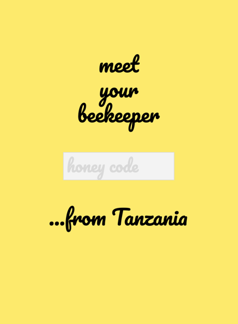

# UPENDO HONEY / TEAM 3
> _Note:_ This document is meant to evolve throughout the planning phase of your project.   That is, it makes sense for you commit regularly to this file while working on the project (especially edits/additions/deletions to the _Highlights_ section). Most importantly, it is a reflection of all the planning you work you've done in the first iteration. 
 > **This document will serve as a master plan between your team, your partner and your TA.**

## Product Details
 
#### Q1: What are you planning to build?

 > Short (1 - 2 min' read)
 * Start with a single sentence, high-level description of the product.
 * Be clear - Describe the problem you are solving in simple terms.
 * Be concrete. For example:
    * What are you planning to build? Is it a website, mobile app,
   browser extension, command-line app, etc.?      
    * When describing the problem/need, give concrete examples of common use cases.
    * Assume your the reader knows nothing about the problem domain and provide the necessary context. 
 * Focus on *what* your product does, and avoid discussing *how* you're going to implement it.      
   For example: This is not the time or the place to talk about which programming language and/or framework you are planning to use.
 * **Feel free (and very much encouraged) to include useful diagrams, mock-ups and/or links**.

#### Q2: Who are your target users?

  > Short (1 - 2 min' read max)
 * Be specific (e.g. a 'a third-year university student studying Computer Science' and not 'a student')
 * **Feel free (but not obligated) to use personas.         
   You can create your personas as part of this Markdown file, or add a link to an external site (for example, [Xtensio](https://xtensio.com/user-persona/)).**

#### Q3: Why would your users choose your product? What are they using today to solve their problem/need?

> Short (1 - 2 min' read max)
 * We want you to "connect the dots" for us - Why does your product (as described in your answer to Q1) fits the needs of your users (as described in your answer to Q2)?
 * Explain the benefits of your product explicitly & clearly. For example:
    * Save users time (how much?)
    * Allow users to discover new information (which information? And, why couldn't they discover it before?)
    * Provide users with more accurate and/or informative data (what kind of data? Why is it useful to them?)
    * Does this application exist in another form? If so, how does your differ and provide value to the users?
    * How does this align with your partner's organization's values/mission/mandate?

#### Q4: How will you build it?

> Short (1-2 min' read max)
 * What is the technology stack? Specify any and all languages, frameworks, libraries, PaaS products or tools. 
 * How will you deploy the application?
 * Describe the architecture - what are the high level components or patterns you will use? Diagrams are useful here. 
 * Will you be using third party applications or APIs? If so, what are they?
 * What is your testing strategy?

#### Q5: What are the user stories that make up the MVP?
 
| #  |     User Story     |  Acceptance Criteria |
|----------|:-------------:|:------:|
| | |
| 1 |  As an ethically-, environmentally- and health-conscious consumer, I want to read about Upendo Honey product and its origins (i.e. beekeepers that produce honey and their work conditions, forests where the honey is produced, honey qualities) in order to decide if Upendo Honey product meets my standards in regards to fair trade for me to buy it / continue buying it. | Information about each honey jar with a QR code / alphanumeric code, beekeepers that produced this honey and the forest of the honey origins should be clearly divided into different app subsections and be one-click accessible within the Upendo Honey application.  |
| | |
| 2 |  As a person who wants to read about Upendo Honey products without spending too much time on it, I want to be able to access information about a particular honey jar and its origins as quickly and as easily as possible to both get the information and save my time and effort.   |   A user should be able to scan QR code with any QR code scanner and/or enter a alphanumeric code at Upendo Honey application to open an application view with all the information about a particular honey jar and its origins    |
| | |
| 3 | As a curious consumer I want to see some new information about the product I consume in order to be entertained. |    UI should be simple and content-oriented to make it easier for a user to see images and read text. |
| | |
| 4 | As a person who likes beekeeper stories / forest images / health information / map information I want to share them on my social media in order to discuss them with my social media friends.|    Facebook, Twitter and Instagram sharing should be available for each beekeeper story / forest information / health information / map. |
| | |
| 5 | As Upendo Honey content manager I want to be able to add new content and edit content easily via an admin system in order to simplify the process of managing the content. |    User-friendly admin system should be available. |
| | |

----

## Process Details

#### Q6: What are the roles & responsibilities on the team?

Describe the different roles on the team and the responsibilities associated with each role. 
 * Roles should reflect the structure of your team and be appropriate for your project. Not necessarily one role to one team member.

List each team member and:
 * A description of their role(s) and responsibilities including the components they'll work on and non-software related work
 * 3 technical strengths and weaknesses each (e.g. languages, frameworks, libraries, development methodologies, etc.)

#### Q7: What operational events will you have as a team?

Describe meetings (and other events) you are planning to have. 
 * When and where? Recurring or ad hoc? In-person or online?
 * What's the purpose of each meeting?
 * Other events could be coding sessions, code reviews, quick weekly sync meeting online, etc.
 * You must have at least 2 meetings with your project partner (if you have one) before D1 is due. Describe them here:
   * What did you discuss during the meetings?
   * What were the outcomes of each meeting?
   * You must provide meeting minutes.
   * You must have a regular meeting schedule established by the second meeting.  
  
#### Q8: What artifacts will you use to self-organize?

Communication and organization are key components to our team’s development process. Slack will continue to act as our main platform for general group communication in-between our (at least) bi-weekly Zoom meetings. We will be using our [Trello](https://trello.com/invite/b/IEykzkUB/007cafd0f1c7c4657b9d4864b5bba527/csc301) board to organize and assign tasks to group members. This will help us stay coordinated with one another, so we can always see who is doing what, and to get a bigger picture of what we are working towards. Our tasks will be prioritized by the degree of importance determined by our partners at Upendo Honey, and of course by the timeline set by course deadlines. We will also be prioritizing tasks that have dependencies farther ahead in the task chain. For example, if one group member is assigned a task, but they require a different task assigned to another group member to be completed first, then the earlier task will be assigned a higher priority and have an earlier deadline to avoid running into bottlenecks. In other words, we will try diligently to foresee task dependencies and assign priorities as needed in those situations.

During our planned Zoom meetings, we discuss the topic we prepared in advance, and determine a schedule for our next Zoom meeting. We typically meet and discuss anywhere from 30 minutes to an hour, depending on our assigned tasks for the week. During our Zoom meetings, we determine what tasks need to be completed before the next deadline, and who will be assigned each task. Tasks will be assigned to team members that volunteer to complete the given task and they will be distributed based on each member's strengths. For instance, some team members have more experience working on the backend, and hence, will be assigned specific tasks within the backend framework.

The status and history of our work from inception to completion will be monitored throughout our Trello board. Smaller tasks will be assigned in the TODO section to a specific member (or members). After the task is completed, we plan on having a code/QA review before merging the changes into the dev/master branch of the repository. On a higher level, we will be monitoring the progression of our development by meeting the milestones set by the course deliverables and through our meetings with our partners. We will self-evaluate our progress at each deliverable and determine how far along we are relative to what we hope to accomplish by the final product.

#### Q9: What are the rules regarding how your team works?

Describe your team's working culture.

**Communications:**
 * What is the expected frequency? What methods/channels are appropriate? 
 * If you have a partner project, what is your process (in detail) for communicating with your partner?
 
**Meetings:**
 * How are people held accountable for attending meetings, completing action items? Is there a moderator or process?
 
**Conflict Resolution:**
 * List at least three team scenarios/conflicts you discussed in lecture and how you decided you will resolve them. Indecisions? Non-responsive team members? Any other scenarios you can think of?

----
### Highlights

### Highlights Presentation
Please see a [Team Highlights presentation](https://docs.google.com/presentation/d/1Jh8lE6_ZKflD1rKErKmilVmNwf8e48eSYzeZLCFF-oA/edit?usp=sharing) (open the link, click 'present' and then 'play').

### Decision-making
After our first team meeting, where we discussed Partners proposals to choose a Partner to work with, we had another important discussion ― in Slack ― on decision making. Each member of our team wanted their voice to be heard and their opinion to be considered; no one wanted to “just get a pass” on this project and to be “only coding”, while others lead the project and make decisions. 
As a result of this discussion we formulated rules of conduct to be followed throughout the project:

 * Each team member should be given an opportunity to speak out
 * Big decisions (like choosing a Partner) should be made by all team members voting anonymously and then discussing the polls results 
 * When at disagreement a compromise should be found, which means each team member has to be ready to meet other team members halfway
 
For example, after we voted for the ‘second-choice Partner option’, EduShare project got the majority of votes. Then, after watching EduShare pitch video, our team had another meeting where a few team members said that the pitch video changed their opinion (the project turned out to be less defined than they thought) and they would like to re-vote. As a result of this discussion, a different project was chosen as the second-choice option.

### Choosing a Partner 
1. The first step in the process of choosing a Partner was for each team member to send their projects shortlist specifying their criteria for selecting a project, what is important to them and pros and cons of this project.

2. The second step was a team meeting where everyone could present their shortlists and discuss their criteria. During this meeting some projects were removed from the shortlist (e.g. MedMe Health which required compliance with health regulations and was only a frontend project).

3. Then we ran an anonymous poll and met again to discuss the poll’s results and finalize the Partner choice.

Please see below examples of our argumentation for adding a project to the shortlist.

### Re-defining Partner’s Project
Reading the Upendo Honey proposal, our team thought that the application will be used mostly by Upendo Honey consumers who already like the product and want to learn more about it. But then, the first meeting with the Partner took us all by surprise.

The Partner was looking for a marketing tool which would create “buzz” around Tanzanian honey. The main feature of the Partner’s existing application is showing a route that honey traveled from Tanzanian forest to a consumer’s table. The Partner wanted to make the app frontend less “clunky” and more responsive. Also, they missed an admin system which would ease their interaction with the database.

Our team left the meeting with an uneasy feeling that the Partner does not have a defined project which could solve the problems their business is facing. Then one of the team members dropped the course. Our team understood that the project is already not what we imagined and that we need to re-think it.

After a discussion with CSC301 Instructor we realized that we had 4 options for the further course of actions:
1. Choose a different Partner, which would take additional time and would not guarantee a well-defined project
2. Improve their existing application, which is doable, but might be not enough for a CSC301 software project
3. Develop a new application based on the mockups the Partner provided, which is also doable, but our team could not understand how a map could create a “buzz”
4. Come up with a new idea for the Partner’s application

Following this, our team asked the Partner if they would be comfortable with us taking the lead. After receiving a positive response, we brainstormed together as a team and came up with an idea of “Letters from Beekeepers” application; we wanted to shift the focus from the map to beekeepers and their stories to possibly create an emotional connection and with that ― talking points.

We created mockups and user flow map and decided to present our idea to the Partner. Our plan was:
 * If the Partner decides to stick with improving the existing software or developing another map, we would ask to change a Partner
 * If the Partner approves the idea, we would adjust it per the Partner’s requests and continue working with Upendo Honey
 
 
 
 
### Product Design
After our presentation, the Partner approved the idea of shifting the focus from the map to beekeepers stories, but also raised a concern that they might not have enough high-quality beekeepers portraits to support this idea.

Considering this obstacle, together with the partner we decided to make a more flexible system allowing the Partner to choose and change a landing page for their application per QR-code; a user might be forwarded to a beekeeper portrait, forest image and story, “health” page or a map. This would allow the Partner to do an A/B testing and see which aspect of their product is more engaging and creates more social response.

